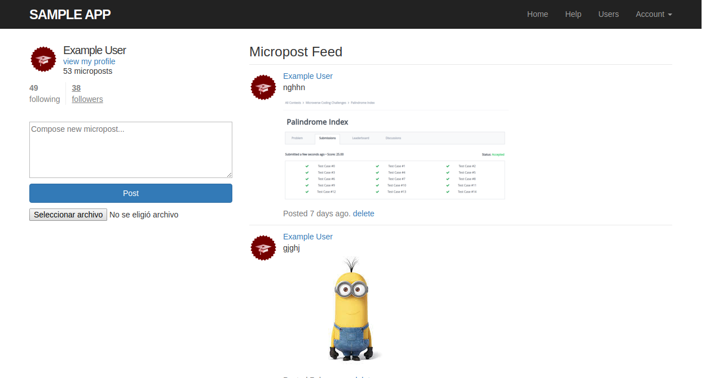

# Ruby on Rails Twitter clone App

Following [Ruby on Rails Tutorial](http://railstutorial.org/)

# What it does

- Users are allowed to sign up and login and log out
- Every User can make their own Posts
- The post can include a picture
- Every user can follow and unfollow the other users
- Every user has their feed with the post of the people tha he follows

# How to run this project

- Install ruby
- Install ruby on rails
- Install bundle
- Run "bundle install" inside folder
- Run "rails server" inside folder
- Go to http://127.0.0.1:3000/

# Live Version Demo
[Click Here](https://intense-springs-41438.herokuapp.com/users/sign_in)

## Authors

**Salvador Olvera**
- Linkedin: [Salvador Olvera](https://www.linkedin.com/in/salvador-olvera-n)
- Github: [@Salvador-ON](https://github.com/Salvador-ON)
- Twitter: [@Salvador Olvera_ON](https://twitter.com/Salvador_ON) 

## Show your support

Give a ⭐️ if you like this project!

## Enjoy!open heroku
